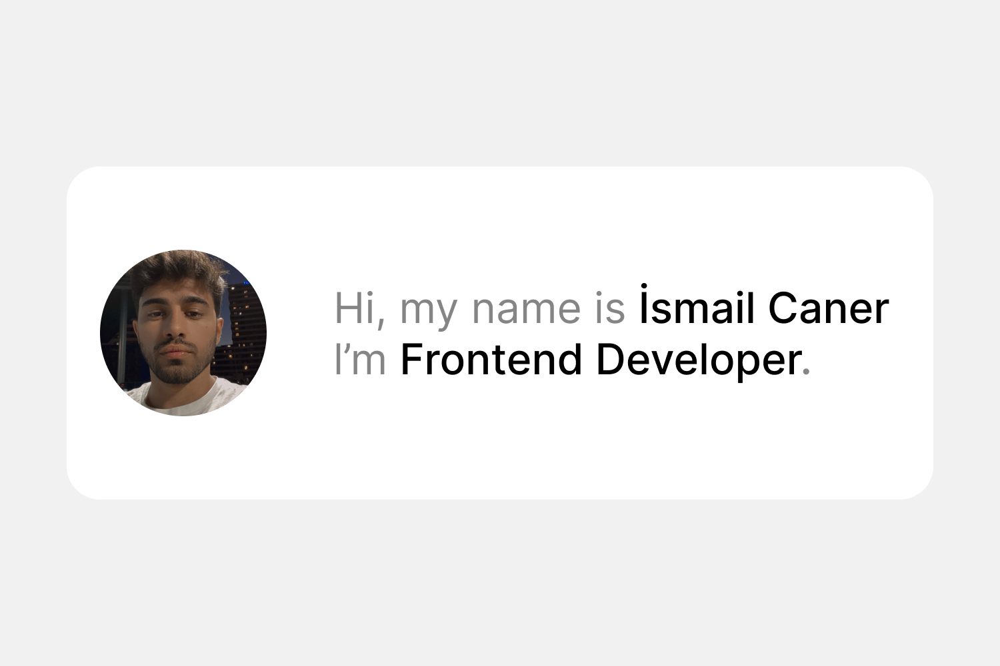

# ismailcaner.com

 
 

Over the years, my personal website has transformed significantly, evolving from a simple static `HTML` page to a sophisticated React application. Today, it embraces a clean, minimalistic design powered by modern technologies like `React.js`, `Next.js`, and `shadcn/ui`, all seamlessly deployed on `Vercel`.

To enrich the experience, I integrate multiple APIs:

`Raindrop API` to dynamically display my curated bookmarks.  
`Unsplash API` to photos. 
`Airtable API` to updating my personal. 
Although this setup represents where I am now in my journey as a junior developer, I’m continuously improving and excited for what’s to come as I refine both the infrastructure and the user experience.

## Overview

- `/` — Home page with `Airtable APIs`.
- `/project` - Side project with `Raindrop APIs`.
- `/photos` - Photos page with `Unsplash APIs`.
- `/bookmarks` — Bookmarks page with `Raindrop APIs`.
- `/api` — API routes.

## Tech Stack

- [Next.js](https://nextjs.org)
- [shadcn/ui](https://ui.shadcn.com)
- [Raindrop](https://raindrop.io)
- [Unsplash](https://ui.shadcn.com)
- [Airtable](https://ui.shadcn.com)
- [Vercel](https://vercel.com)
